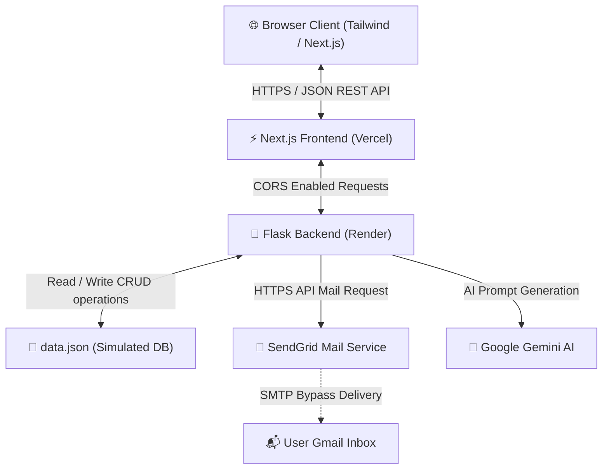
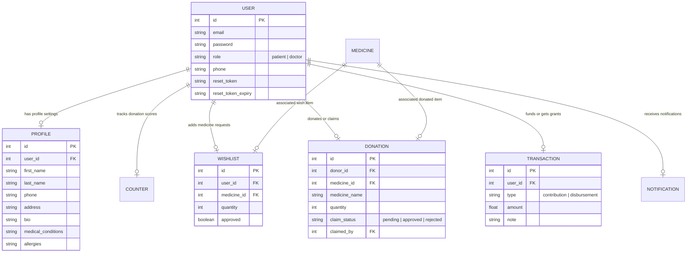
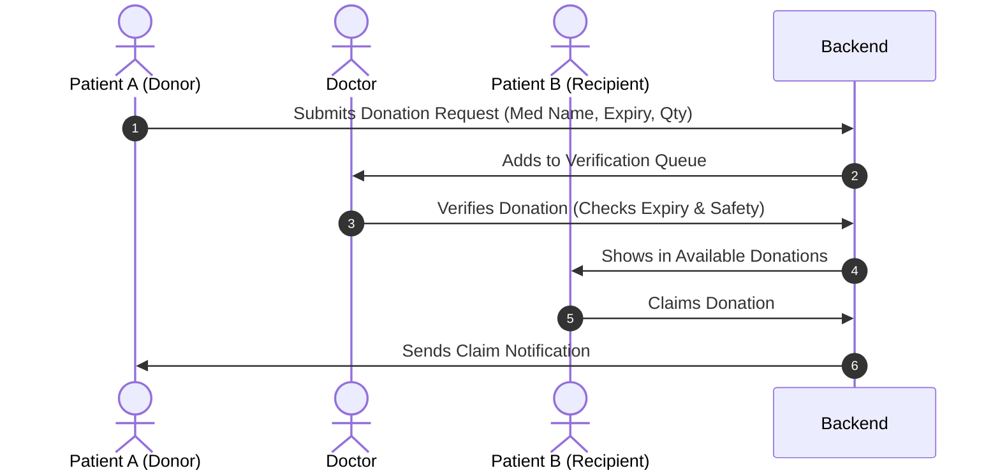
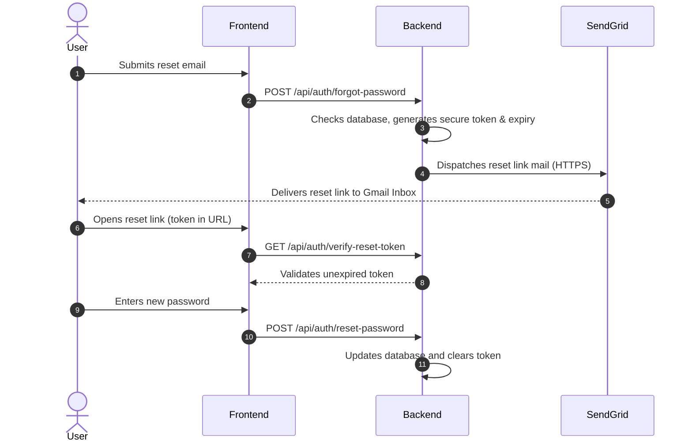

# 💙 MedoraLink
### *Connecting Communities to Affordable Healthcare*

MedoraLink is a modern, community-driven healthcare accessibility platform designed to reduce medical waste, lower prescription drug costs, and provide compassionate AI-powered health guidance. 

By combining community donations, bulk-order group splitting, micro-grants, and licensed doctor verification, MedoraLink ensures that **essential medication is never out of reach due to financial barriers.**

---

## 🚀 Key Features

*   **💊 Medicine Donation System:** Safely donate unused, unexpired medications to verified members of your local community.
*   **📦 Bulk Order Splitting:** Coordinate with other community members to buy medications in bulk, cutting retail markup costs significantly.
*   **🩺 Doctor Verification Flow:** A trust-based doctor dashboard to verify prescriptions, review medication donations, and approve micro-grants for patient safety.
*   **💳 Micro-Grants & Financial Aid:** An integrated community fund tracker allowing members to contribute or request micro-grants for emergency medication purchases.
*   **🤖 AI Healthcare Chatbot:** Compassionate assistance powered by Google Gemini AI to translate prescriptions, summarize medication instructions, and answer wellness queries.
*   **🔐 Secure Verification & Password Reset:** Deployed-safe security with token-based email password resets using SendGrid's HTTP API.

---

## 🛠️ Technology Stack

| Layer | Technologies | Purpose |
| :--- | :--- | :--- |
| **Frontend** | Next.js 14 (App Router), React 18, Tailwind CSS, TypeScript | Highly responsive user interface with rich HSL theme |
| **Backend** | Python, Flask, Flask-CORS, python-dotenv, Gunicorn | Lightweight RESTful routing and logic server |
| **Database** | Simulated JSON Database (`data.json`) | File-based prototype DB with automatic auto-increment ID counters |
| **Email API** | SendGrid v3 HTTP API | Secure domain-less email delivery for password resets |
| **AI Engine** | Google Gemini Generative AI SDK | Chatbot support, translation, and text summarization |
| **Hosting** | Vercel (Frontend), Render Free Tier (Backend) | Live production hosting |

---

## 🏗️ System Architecture



---

## 📊 Database Entity-Relationship (ER) Diagram



---

## 🔄 Core User Workflows

### 1. Medicine Donation Flow


### 2. Password Reset Flow


---

## 🌟 Advantages of MedoraLink

*   **🌱 Reduces Environmental Medicine Waste:** Millions of dollars of unused medicines are incinerated annually. MedoraLink intercepts usable medicines and gives them to patients in need.
*   **📉 Massive Cost Savings:** Splitting bulk medicine orders allows patients to bypass high retail packaging markups.
*   **🛡️ Doctor-Led Safety Guardrails:** Prescriptions and medical histories are verified by a dashboard to ensure that users do not claim incompatible or dangerous drugs.
*   **🤝 Collaborative Financial Support:** The micro-grant wallet allows peers to pool funds together to purchase medicines for patients going through financial hardships.

---

## 💻 Step-by-Step Local Execution

Follow these steps to run the Next.js frontend and Flask backend locally on Windows.

### Prerequisites
*   Node.js (v18+)
*   Python (v3.10+)

### Setup 1: Backend Setup
```powershell
# Navigate into backend directory
cd backend

# Create and activate a python virtual environment
python -m venv .venv
.\.venv\Scripts\Activate.ps1

# Install dependency packages
python -m pip install --upgrade pip
pip install -r requirements.txt

# Start Flask Server
python app.py
```
*The backend will boot up locally at **`http://localhost:5050`**.*

### Setup 2: Frontend Setup
Open a new, separate PowerShell terminal window:
```powershell
# Navigate into frontend directory
cd frontend

# Install package dependencies
npm install

# Start Next.js Development Server
npm run dev
```
*The frontend will start locally at **`http://localhost:3000`**.*

---

## ☁️ Online Deployment Setup (Production)

To share the application with your friends online, use **Render** (for the Flask backend) and **Vercel** (for the Next.js frontend).

### 1. Render Deployment (Backend)
1. Set the **Root Directory** settings to **`backend`**.
2. Set the **Build Command** to `pip install -r requirements.txt`.
3. Set the **Start Command** to `gunicorn app:app`.
4. Configure the **Environment Variables**:
   * `SENDGRID_API_KEY` = `SG.your_sendgrid_api_key` *(for Gmail delivery)*
   * `SENDGRID_SENDER` = `your-verified-email@gmail.com` *(Single Sender verified email)*
   * `GEMINI_API_KEY` = `your_google_gemini_api_key` *(for Chatbot)*
   * `FRONTEND_URL` = `https://medora-link.vercel.app` *(Your Vercel URL)*

### 2. Vercel Deployment (Frontend)
1. Import your repository on Vercel.
2. Edit **Root Directory** to point to **`frontend`**.
3. In **Environment Variables**, add:
   * `NEXT_PUBLIC_API_URL` = `https://medora-link-backend.onrender.com` *(Your Render URL)*
